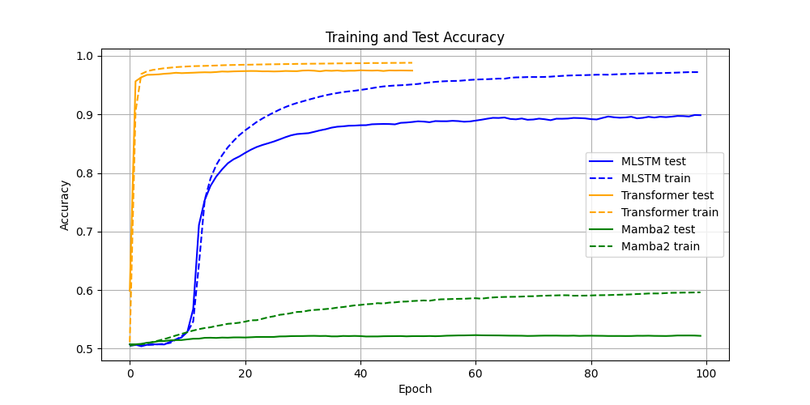

# Visual Recognition Memory Task

This goal of this project is to train machine learning models to memorize and recognize frames from videos. The task is inspired by the experimental procedure of [Zheng et al. - 2022](https://doi.org/10.1038/s41593-022-01020-w). It consists in first presenting a sequence of short clips (90 clips of approximately 10 seconds duration), and then testing the model's ability to classify 180 frames as either "old" (if the frame was part of the clips) or "new" (if the frame was not seen before). The dataset of videos used to generate the clips and the test frames is the [Short Film Dataset - Ghermi et al. - 2024](https://arxiv.org/abs/2406.10221). The file `sfd.csv` was downloaded [here](https://github.com/ridouaneg/sf20k/blob/main/data/sfd.csv). For an example of a training sequence, see [here](https://drive.switch.ch/index.php/s/zc5zErycNHhOPV2) (the last 3 minutes contain test frames shown for 1 second).

We use [pixi](https://pixi.sh) for dependency management (see [pixi installation](https://pixi.sh/v0.45.0/#installation)).

## Download Dataset

Download the dataset [here](https://drive.switch.ch/index.php/s/R6vof2bXw3vdkEY) (26.3 GB), or generate it from scratch.

<details>
    <summary>Generate Dataset from Scratch</summary>

### Download Videos

```bash
pixi run python download_videos.py
```

### Preprocess Videos

Videos are first preprocessed by feeding each of their frames to a pretrained convolutional neural network (pytorch's resnet18 by default) to extract 512 dimensional feature vectors for each frame.

```bash
pixi run -e gpu python preprocess_videos.py
```

### Generate Dataset
Generate the indices of the frames to be used for training and testing.

```bash
pixi run python generate_dataset.py
```

</details>

## Training Models

The main script to train and test the network is `train.py`. All parameters can be set in a YAML configuration file, which is passed as an argument to the script.

```bash
pixi run -e gpu python train.py -f config-files/transformer.yaml
```

Make sure to set the `WANDB_API_KEY` environment variable (e.g. `export WANDB_API_KEY="YOUR WANDB API KEY"`), if `wandb: True` in the config file. We use `nvcr.io/nvidia/pytorch:24.10-py3` images for training on `V100` or `A100` GPUs.

The recurrent neural network can be chosen to be an lstm, an improved version of the lstm incorporating a refined gating mechanism ([Gu et al. - 2019](https://arxiv.org/abs/1910.09890)), or a mamba network. Several layers of them can be stacked.

The file `ur_lstm.py` contains the implementation of the improved lstm, it was taken from [this repository](https://gist.github.com/abhshkdz/185f6babd3858fa7c5f0bc986bbca767).

### Example Results

With the settings in the config-files, the models "see" 9000 frames of 512 features, and subsequently 180 test frames for which the model needs to decide whether the test frame was in the 9000 seen frames or not (randomized order, 90 seen, 90 unseen test frames). Test sequences are generated with videos that are not used in the training set. Below are accuracies for models based on a simple transformer (with two blocks), or one mLSTM or mamba2 block.


